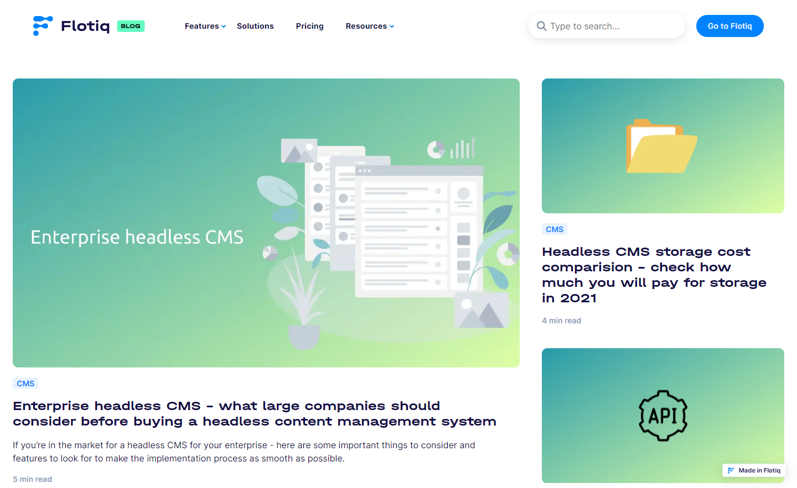
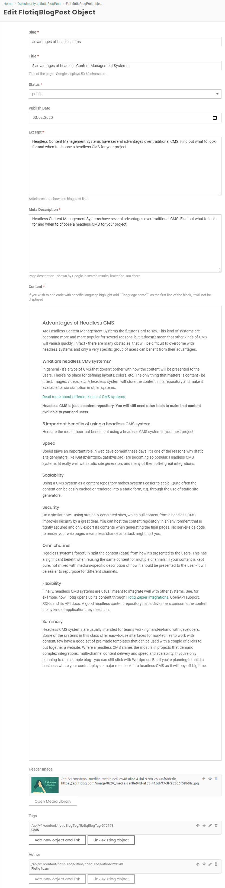

<a href="https://flotiq.com/">
    
</a>

Flotiq Blog
==============

This is a [Gatsby](https://gatsbyjs.org) starter project for a blog with tags and authors. It's configured to pull recipe data from [Flotiq](https://flotiq.com) and can be easily deployed to your cloud hosting - Heroku, Netlify, Gatsby Cloud, etc.

See it live on [Flotiq/Blog](https://flotiq.com/blog/)

Screenshot



## Quick start

1. **Start the project from template using [Flotiq CLI]((https://github.com/flotiq/flotiq-cli))**

   Create your [Flotiq.com](https://flotiq.com) account.

    ```bash
   npm install -g flotiq-cli
   flotiq start [flotiqApiKey] [projectName] https://github.com/flotiq/flotiq-blog.git
    ```
    * `flotiqApKey` - Read and write API key to your Flotiq account
    * `projectName` - project name or project path (if you wish to start or import data from the current directory - use `.`)

3. **You can also start the project from template using Gatsby CLI**

    ```bash
    gatsby new flotiq-blog https://github.com/flotiq/flotiq-blog.git
    ```
4. **Setup "flotiqBlogTag", "flotiqBlogAuthor", and "flotiqBlogPost" Content Type in Flotiq**

   This step is optional and is not necessary if you used flotiq-cli to start the project.

   If you wish to import example posts, tags and authors to your account, before running `gatsby develop` run:

    ```sh
    flotiq import [flotiqApiKey] .
    ```

   It will add 4 images, 1 tag, 1 author and 3 posts to your Flotiq account.

   _Note: You need to put your Read and write API key as the `flotiqApiKey` for import to work You don't need any content types in your account. If you already have tag with ids `flotiqBlogTag-1`, author with `flotiqBlogAuthor-1` or posts with ids `flotiqBlogPost-1`, `flotiqBlogPost-2` and `flotiqBlogPost-3` they will be overwritten._

5. **Configure application**

   The next step is to configure our application to know from where it has to fetch the data.

   You need to create a file called `.env.development` inside the root of the directory, with the following structure:

    ```
    FLOTIQ_API_KEY=YOUR FLOTIQ API KEY
    SCOPED_FLOTIQ_API_KEY=YOUR SCOPED FOR POSTS SEARCH FLOTIQ API KEY
    GA_TRACKING_ID=YOUR GA TRACKING KEY
    ```
   
    `FLOTIQ_API_KEY` should be the Read-only Application key and `SCOPED_FLOTIQ_API_KEY` should be Scoped User key with read-only access to blog posts, media, tags and authors.
   
6. **Start developing**

    Navigate into your new site’s directory and start it up.

    ```sh
    cd flotiq-blog
    yarn install
    gatsby develop
    ```

7. **Open the source code and start editing!**

    Your site is now running at [http://localhost:8000](http://localhost:8000)!

    _Note: You'll also see a second link: _[http://localhost:8000/___graphql](http://localhost:8000/___graphql)`_. This is a tool you can use to experiment with querying your data. Learn more about using this tool in the [Gatsby tutorial](https://www.gatsbyjs.org/tutorial/part-five/#introducing-graphiql)._

    Open a project directory in your code editor of choice and edit `src/templates/index.js`. Save your changes, and the browser will update in real time!

8. **Manage your posts using Flotiq editor**

   You can now easily manage your posts using [Flotiq editor](https://editor.flotiq.com)

   

# Deploy

You can deploy this project to Heroku in 3 minutes:

[](https://heroku.com/deploy?template=https://github.com/flotiq/flotiq-blog)

Or to Netlify:

[](https://app.netlify.com/start/deploy?repository=https://github.com/flotiq/flotiq-blog)

## Collaborating

If you wish to talk with us about this project, feel free to hop on our [](https://discord.gg/FwXcHnX).

If you found a bug, please report it in [issues](https://github.com/flotiq/flotiq-blog/issues).

